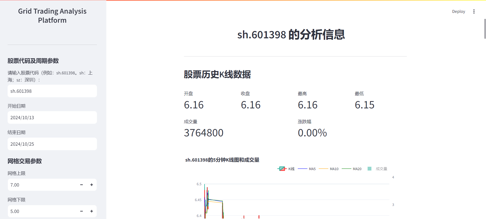
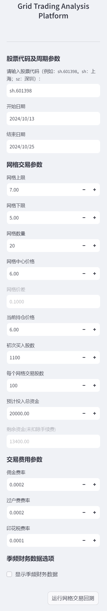
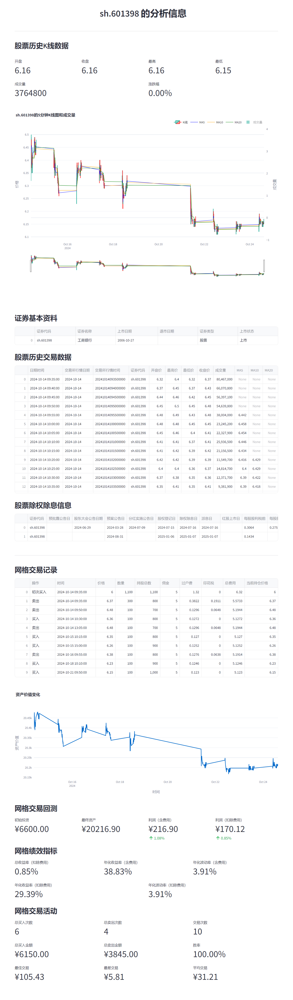

# GTAP - Grid Trading Analysis Platform

<div align="center">

**股票网格交易回测平台**

[](https://www.python.org/)
[](LICENSE)
[](CHANGELOG.md)

</div>

这是一个使用 Streamlit 构建的股票分析和网格交易回测平台。网格交易是一种自动化交易策略，通过在价格区间内设置多个网格来进行买卖操作。当价格下跌时买入，上涨时卖出，从而在震荡行情中获利。该平台可以帮助用户设置网格参数，回测历史数据，评估网格交易策略的效果。

## ✨ 功能特性

- 📊 **数据获取**: 输入股票代码获取历史交易数据 (支持沪市/深市 A 股)
- 📈 **K 线图表**: 绘制交互式 K 线图展示股票价格走势
- 📉 **技术指标**: MA5、MA10、MA20 均线显示
- 💼 **公司信息**: 股票基本信息和除权除息数据
- 📋 **财务数据**: 可选显示季频财务数据（盈利能力、营运能力、成长能力等）
- 🔁 **网格回测**: 执行网格交易回测，计算收益率、波动率等绩效指标
- 💰 **费用模拟**: 精确计算佣金、过户费、印花税

## 🖼️ 效果展示

<div align="center">

| 主界面 | 回测结果 | 绩效指标 |
|--------|----------|----------|
|  |  |  |

*图 1: 网格交易配置 + K 线图 | 图 2: 资产价值变化 + 交易记录 | 图 3: Sharpe 比率等绩效指标*

</div>

## 🚀 快速开始

### 安装

1. **克隆仓库**:
   ```bash
   git clone https://github.com/reven-tang/gtap.git
   cd gtap
   ```

2. **创建虚拟环境 (推荐)**:
   ```bash
   # macOS/Linux
   python3 -m venv venv
   source venv/bin/activate
   
   # Windows
   python -m venv venv
   .\venv\Scripts\activate
   ```

3. **安装依赖**:
   ```bash
   pip install --upgrade pip
   pip install -r requirements.txt
   ```

   或使用打包方式:
   ```bash
   pip install -e .
   ```

### 运行

```bash
streamlit run app.py
```

然后在浏览器打开 `http://localhost:8501`

## 📁 项目结构 (v0.2.0+)

```
gtap/
├── src/gtap/              # 核心模块包
│   ├── __init__.py        # 公共 API 导出
│   ├── config.py          # 配置类与验证
│   ├── data.py            # 数据获取（baostock）
│   ├── fees.py            # 交易费用计算
│   ├── grid.py            # 网格回测引擎
│   ├── metrics.py         # 绩效指标计算
│   ├── plot.py            # 图表绘制
│   └── exceptions.py      # 自定义异常
├── app.py                 # Streamlit 应用入口
├── tests/                 # 单元测试（27 个测试）
│   ├── test_config.py
│   ├── test_fees.py
│   ├── test_grid.py
│   └── test_metrics.py
├── gtap.py                # 旧版单文件（保留用于对比）
├── requirements.txt       # 依赖清单
├── pyproject.toml         # 项目配置
├── ROADMAP.md             # 版本路线图
├── CHANGELOG.md           # 版本变更日志
└── README.md              # 本文件
```

> **注**: v0.2.0 起项目采用模块化架构，`app.py` 为新入口，旧 `gtap.py` 保留用于参考。

## 🛠️ 技术栈

- **前端**: Streamlit 1.50.0
- **数据处理**: Pandas 2.3.3, NumPy 1.26.4+
- **可视化**: Plotly 6.7.0, Matplotlib 3.9.4, mplfinance 0.12.10b0
- **数据源**: baostock 0.9.9 (免费 A 股数据)
- **测试**: pytest 8.x

## ⚠️ 注意事项

- 需要稳定的网络连接以获取实时股票数据
- 网格交易回测结果仅供参考，**不构成投资建议**
- 使用季频财务数据功能可能会增加数据加载时间
- 仅支持中国 A 股市场 (沪市/深市)

## 🤝 贡献

欢迎提交 Issue 和 Pull Request！对于重大改动，建议先开 Issue 讨论。

## 📄 许可证

MIT License - 详见 [LICENSE](LICENSE)

## 🔗 参考链接

- [什么是网格交易？](https://www.atfx.com/zh-hans/analysis/trading-strategies/what-is-grid-trading-how-does-it-work)
- [用 Python 实现网格交易回测](http://defiplot.com/blog/grid-trading-with-python/)
- [宝哥股票数据接口](http://baostock.com/baostock/index.php/Python_API%E6%96%87%E6%A1%A3)
