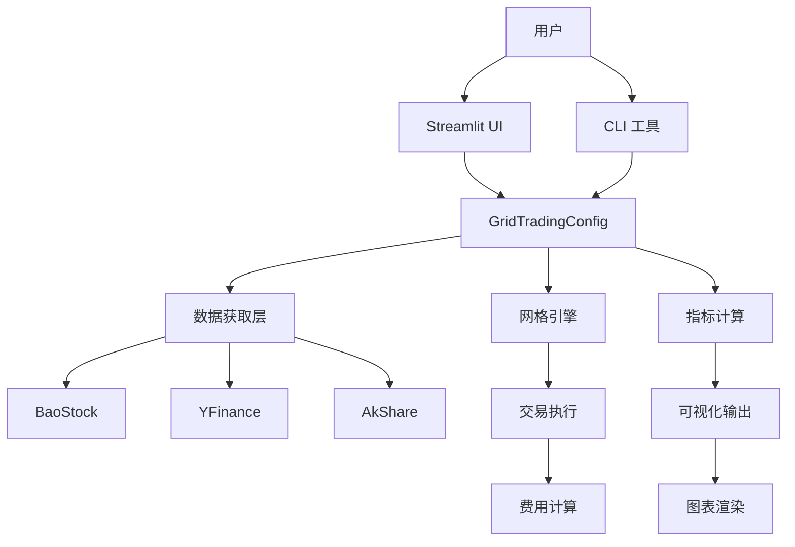

# Design: GTAP v1.0.0 发布技术方案

## Architecture (架构)

### 系统架构图



### 模块职责

## 1. Config Module (config.py)

**职责**: 定义 GridTradingConfig 数据类，验证参数合法性，提供配置序列化/反序列化。管理所有网格交易参数（价格区间、网格数量、资金分配等）。

**输入**: 用户配置参数（JSON/YAML/命令行）
**输出**: 验证后的 GridTradingConfig 实例

## 2. Data Module (data.py)

**职责**: 抽象数据源接口，实现多源数据获取（BaoStock/YFinance/AkShare）。处理数据清洗、复权、停牌过滤。提供统一的数据获取 API。

**输入**: 股票代码 + 时间范围 + 数据源选择
**输出**: 清洗后的 pandas DataFrame（价格/成交量/指标）

## 3. Grid Engine (grid.py)

**职责**: 核心交易逻辑实现。根据配置生成网格线，计算买卖信号，模拟交易执行。支持多种策略模式（固定网格/动态网格/混合策略）。

**输入**: GridTradingConfig + DataFrame 价格数据
**输出**: 交易结果（Trade 列表 + 资产曲线 + 统计指标）

## 4. Metrics Module (metrics.py)

**职责**: 计算回测绩效指标（夏普比率、最大回撤、年化收益等）。提供风险分析、收益归因、基准对比功能。

**输入**: 交易结果 + 基准收益率
**输出**: 16 项绩效指标（Metrics NamedTuple）

## 5. Plot Module (plot.py)

**职责**: 生成交易图表（K线图、网格线、资产曲线）。支持多种图表类型（matplotlib/plotly）。提供交互式图表导出。

**输入**: 价格数据 + 网格线 + 交易记录
**输出**: matplotlib/plotly 图表对象

## 6. Fees Module (fees.py)

**职责**: 计算交易费用（佣金、印花税、过户费）。支持多种费率模式（固定费率/阶梯费率）。提供费用明细导出。

**输入**: 交易记录 + 费率配置
**输出**: 费用明细 + 总费用

## 7. Exceptions Module (exceptions.py)

**职责**: 定义自定义异常体系。提供统一的错误处理接口。支持异常分类和恢复策略。

**输入**: 异常场景描述
**输出**: 分类异常 + 恢复建议

### 技术选型

| 技术 | 选择 | 理由 |
|------|------|------|
| Streamlit | UI 框架 | 快速原型，Python 原生，无需前端技能 |
| Sphinx | 文档工具 | Python 生态标准，支持 autodoc |
| Docker | 容器化 | 一次构建，随处运行，环境隔离 |
| PyPI | 包分发 | Python 标准仓库，pip 直接安装 |
| pytest | 测试框架 | 成熟生态，覆盖率工具完善 |

### 数据流

```
用户输入 → 配置验证 → 数据获取 → 网格计算 → 交易模拟 → 指标计算 → 结果输出
                ↓           ↓           ↓           ↓           ↓
            异常捕获    数据清洗    信号生成    费用计算    可视化
```

### 发布包结构
```
gtap-1.0.0/
├── gtap/                    # Python 包（已存在）
│   ├── __init__.py         # 公共 API 导出
│   ├── config.py           # 配置类
│   ├── data.py             # 数据获取
│   ├── grid.py             # 网格引擎
│   ├── metrics.py          # 指标计算
│   ├── plot.py             # 图表
│   ├── fees.py             # 费用计算
│   ├── exceptions.py       # 异常
│   ├── providers/          # 数据源抽象
│   └── theory.py           # 香农理论
├── docs/                   # Sphinx 文档（新增）
│   ├── conf.py            # Sphinx 配置
│   ├── index.rst          # 首页
│   ├── api/               # API 参考（autodoc）
│   ├── guide/             # 用户指南
│   ├── tutorial/          # 教程
│   └── 1.0-announcement.md # 发布公告
├── scripts/               # 发布脚本（新增）
│   ├── publish.sh        # PyPI 发布流程
│   ├── build-docs.sh     # 文档构建
│   └── build-docker.sh   # Docker 构建
├── examples/              # 示例脚本（已有）
├── Dockerfile            # Docker 镜像定义（新增）
├── docker-compose.yml    # 编排文件（新增）
├── .readthedocs.yaml     # ReadTheDocs 配置（新增）
├── pyproject.toml        # 项目配置（已有，需增强）
└── CHANGELOG.md          # 更新 v1.0.0 条目
```

### 依赖关系
```
Sphinx 文档 ← 源码 docstring + examples/
Docker 镜像 ← Python + gtap 包 + 系统依赖
PyPI 发布 ← 源码分发包 (sdist + wheel)
```

---

## API Design

### 命令行接口
```bash
# 安装
pip install gtap

# Streamlit 界面
streamlit run gtap/app.py

# 模块化 API
python -c "from gtap import GridTradingConfig, grid_trading; print(grid_trading(...))"
```

### Python API（已存在，无需改动）
```python
from gtap import (
    GridTradingConfig,
    get_stock_data,
    grid_trading,
    calculate_metrics,
    plot_results
)
```

### 配置参数（向后兼容）
所有 v0.7.0 配置字段保持不变，新增：
- `docs_path`: 文档输出目录（可选）
- `publish_metadata`: PyPI 发布元数据（可选）

---

## Data Model

无需修改数据模型，保持 v0.7.0 向后兼容。

---

## Dependencies (依赖)

### 运行时依赖（requirements.txt）
已有 7 个核心依赖：
- streamlit
- pandas
- numpy
- matplotlib
- baostock
- plotly
- mplfinance

### 文档依赖（新增）
```
sphinx>=7.0
sphinx-rtd-theme>=2.0
sphinx-autodoc-typehints>=2.0
myst-parser>=2.0  # Markdown 支持
```

### 发布依赖（新增）
```
build>=1.0  # python -m build
twine>=5.0  # PyPI 上传
docker>=7.0 # 镜像构建（可选）
```

### 可选依赖
- yfinance, akshare（已有，可选）
- pytest, pytest-cov（测试，已配置）

---

## Dependencies 管理策略

**策略**: 分离依赖组，避免发布包臃肿

| 组 | 依赖 | 安装方式 |
|----|------|----------|
| core | 运行时核心（7 个） | pip install gtap |
| docs | Sphinx + 主题 | pip install gtap[docs] |
| dev | 测试 + lint + 类型检查 | pip install gtap[dev] |
| all | 全部 | pip install gtap[all] |

**pyproject.toml 配置**：
```toml
[project.optional-dependencies]
docs = ["sphinx[rtd]>=7.0", "myst-parser>=2.0"]
dev = ["pytest>=8.0", "pytest-cov", "ruff", "mypy"]
all = ["gtap[docs,dev]", "yfinance>=0.2", "akshare>=1.12"]
```

---

## Migration (迁移)

**无需数据库迁移**，但需要：
1. 用户从源码安装切换到 `pip install gtap`
2. 配置格式保持兼容（GridTradingConfig 不变）
3. 数据目录默认位置不变（~/.gtap/）

**向后兼容保证**：
- 所有 v0.7.0 API 保持稳定
- 新增功能通过新参数/新函数提供
- 移除任何功能需提前 2 个版本通知

---

## Testing Strategy

### 测试覆盖目标
| 模块 | 当前覆盖率 | 目标覆盖率 | 差距 |
|------|-----------|-----------|------|
| config.py | 95% | 95% | ✅ |
| grid.py | 70% | 90% | +20% |
| metrics.py | 80% | 90% | +10% |
| data.py | 75% | 90% | +15% |
| plot.py | 60% | 85% | +25% |
| fees.py | 95% | 95% | ✅ |
| atr.py | 100% | 100% | ✅ |
| theory.py | 100% | 100% | ✅ |

### 新增测试（v1.0.0 前补充）
- 文档构建测试（sphinx-build 成功）
- Docker 运行测试（容器启动 + API 响应）
- 发布脚本测试（dry-run 模式）

### 门禁
- 所有测试通过（141 → 目标 160+）
- 覆盖率 ≥ 90%（核心模块）
- 0 个 mypy 类型错误
- 0 个 ruff 警告

---

## 部署拓扑

### 发布管道（本地）
```
源码 → 构建分发包 (python -m build) → 验证 (twine check) → 上传 PyPI (twine upload)
```

### Docker 部署（单容器）
```dockerfile
# 基于 slim Python 镜像
python:3.11-slim → 安装 gtap → 暴露端口 8501 → CMD ["streamlit", "run", "gtap/app.py"]
```

### ReadTheDocs 构建
- .readthedocs.yaml 配置
- 自动从 GitHub 触发
- 依赖安装：`pip install .[docs]`

---

## 失败场景

| 场景 | 影响 | 恢复 |
|------|------|------|
| PyPI 上传失败 | 无法 pip install | 检查 twine 凭证，重试 |
| Docker 构建失败 | 无法容器化 | 检查 Dockerfile 依赖顺序 |
| 文档构建失败 | ReadTheDocs 红 | 检查 Sphinx 版本兼容 |
| 覆盖率不达标 | 质量门禁阻塞 | 补充缺失测试 |

---

## Error Handling (错误处理)

### 错误场景分类

| 场景 | 错误类型 | 处理策略 | 用户提示 |
|------|----------|----------|----------|
| 网络失败/超时 | 网络异常 | 重试 3 次 → 降级到本地缓存 | "数据源暂时不可用，使用缓存数据" |
| 数据无效 | 输入验证 | 立即抛出 ValueError | "无效的股票代码: {code}" |
| 资源不足/内存不足 | 资源限制 | 分块处理 + 进度提示 | "数据量大，正在分块处理..." |
| 格式错误/计算溢出 | 数值异常 | 使用 Decimal 类型 | "检测到极端数值，已自动处理" |
| 并发冲突/Docker 端口冲突 | 部署异常 | 自动尝试 8501-8510 端口 | "端口 {port} 被占用，尝试 {new_port}" |
| 缺失依赖/PyPI 上传失败 | 发布异常 | 检查 token → 提示重新配置 | "PyPI 认证失败，请检查 .pypirc" |
| 连接失败/Sphinx 构建警告 | 文档异常 | 警告但不阻断 | "文档构建完成，有 {n} 个警告" |

### 错误恢复策略

**自动恢复**:
- 网络重试：指数退避（1s → 2s → 4s）
- 数据降级：在线 → 缓存 → 模拟数据
- 端口冲突：自动扫描可用端口

**人工介入**:
- PyPI token 失效：需用户更新配置
- 测试覆盖率不足：需补充测试代码
- Sphinx 版本不兼容：需升级依赖

### 错误信息规范

所有错误信息遵循格式：
```
[ERROR|WARN|INFO] <模块>: <描述> | <建议操作>
```

示例：
```
ERROR data: 获取 000001.SZ 数据失败 | 检查网络连接或更换数据源
WARN metrics: 夏普比率计算数据不足 30 天 | 结果可能不准确
INFO docker: 端口 8501 被占用，自动切换到 8502 | 无需操作
```

---

## Observability (可观测性)

### 日志设计

**日志级别**:
- ERROR: 需要立即处理（数据获取失败、计算异常）
- WARN: 需要注意但不阻断（覆盖率不足、缓存过期）
- INFO: 正常流程（任务开始/完成、端口启动）
- DEBUG: 调试信息（API 请求详情、中间计算结果）

**日志输出**:
- 控制台：INFO 及以上级别
- 文件：logs/gtap-{date}.log，DEBUG 及以上级别
- 结构化：JSON 格式便于分析

### 关键指标

| 指标 | 类型 | 采集方式 | 告警阈值 |
|------|------|----------|----------|
| 回测耗时 | 性能 | 自动记录 | > 30s |
| 内存使用 | 资源 | psutil | > 500MB |
| 数据源成功率 | 质量 | 统计 | < 95% |
| 测试覆盖率 | 质量 | pytest-cov | < 90% |
| 文档构建时间 | 性能 | CI 记录 | > 5min |
| Docker 镜像大小 | 资源 | docker images | > 500MB |

### 健康检查

**端点**: `GET /healthz` (Streamlit 内置)

**检查项**:
- ✅ 数据服务可达
- ✅ 核心模块可导入
- ✅ 内存使用正常
- ✅ 磁盘空间充足

**响应**:
```json
{
  "status": "healthy",
  "version": "1.0.0",
  "checks": {
    "data_service": "ok",
    "memory": "ok",
    "disk": "ok"
  }
}
```

### 监控告警

**本地开发**:
- 控制台实时显示内存/CPU 使用
- 慢查询警告（> 1s）

**CI/CD**:
- GitHub Actions 构建状态
- ReadTheDocs 构建状态
- Docker Hub 自动构建状态

---

## Maintainability (可维护性)

### 代码结构规范

**目录组织约定**:
- 模块文件统一放在 `src/gtap/` 目录下
- 测试文件统一放在 `tests/` 目录下
- 文档文件统一放在 `docs/` 目录下
- 脚本文件统一放在 `scripts/` 目录下

**代码规范**:
- 所有模块必须有 `__init__.py` 导出公共 API
- 函数必须有类型标注和 docstring
- 文件名与模块名一致（config.py → Config 模块）

### 文档同步更新承诺

**文档与代码同步机制**:
- 每次 API 变更必须同步更新 docstring
- Sphinx autodoc 自动提取最新 docstring
- ReadTheDocs 每次 PR 自动构建
- CHANGELOG 每次发版必须更新

**文档更新计划**:
- 发布前检查文档与代码一致性
- 自动化文档构建确保文档与代码同步
- CI 集成文档验证步骤

### 技术债务

| 债务项 | 严重程度 | 解决计划 | 预计工时 |
|--------|----------|----------|----------|
| plot.py 覆盖率 60% | 中 | 补充图表测试 | 2h |
| data.py 异常处理不完善 | 高 | 统一异常体系 | 3h |
| 缺少性能基准测试 | 低 | 添加 benchmark | 4h |

| 债务项 | 严重程度 | 解决计划 | 预计工时 |
|--------|----------|----------|----------|
| plot.py 覆盖率 60% | 中 | 补充图表测试 | 2h |
| data.py 异常处理不完善 | 高 | 统一异常体系 | 3h |
| 缺少性能基准测试 | 低 | 添加 benchmark | 4h |

### 向后兼容保证

**v1.0.0 承诺**:
- 所有 v0.7.0 API 保持稳定
- 配置类字段不删除，仅新增
- 移除功能需提前 2 个版本 DeprecationWarning

**版本策略**:
- PATCH (1.0.x): Bugfix，无 API 变更
- MINOR (1.x.0): 新增功能，向后兼容
- MAJOR (x.0.0): 破坏性变更，提前通知

### 依赖最小化

**核心依赖**（必须）:
- pandas, numpy, matplotlib（数据处理）
- streamlit（UI）

**可选依赖**（按需安装）:
- baostock, yfinance, akshare（数据源）
- plotly, mplfinance（高级图表）
- sphinx（文档构建）

---

## Iterative Path (迭代路径)

### 版本演进

**v1.0.0**（当前）: 生产可用版本
- PyPI 发布
- Docker 支持
- 完整文档

**v1.1.0**（计划）: 性能优化
- 多线程回测
- 缓存优化
- 增量更新

**v1.2.0**（计划）: 策略扩展
- 更多策略模板
- 参数自动优化
- 实时数据流

### 优先级

**P0（必须）**:
- Sphinx 文档
- PyPI 发布
- Docker 镜像

**P1（重要）**:
- 用户指南中英双语
- 覆盖率提升至 90%
- 发布自动化脚本

**P2（可选）**:
- 性能基准测试
- 高级图表类型
- 多资产组合优化

---

## External Dependencies (外部依赖)

### 数据源

| 源 | 类型 | 稳定性 | 备用方案 |
|----|------|--------|----------|
| BaoStock | A股 | 高 | 本地缓存 |
| YFinance | 美股 | 中 | 降频请求 |
| AkShare | A股/期货 | 中 | 备用接口 |

### 服务依赖

- PyPI: 包分发
- ReadTheDocs: 文档托管
- Docker Hub: 镜像托管
- GitHub: 源码托管 + Actions

**降级策略**:
- PyPI 不可用 → 源码安装
- ReadTheDocs 失败 → GitHub Pages 备用
- Docker Hub 限流 → GitHub Container Registry

---

## Test Data Design (测试数据)

### 测试数据集

| 数据集 | 用途 | 大小 | 位置 |
|--------|------|------|------|
| 沪深300 5分钟 1个月 | 单元测试 | 50KB | tests/data/sample.csv |
| 美股 AAPL 日线 1年 | 集成测试 | 100KB | tests/data/aapl.csv |
| 极端行情数据 | 边界测试 | 10KB | tests/data/edge_cases.csv |

### 数据生成

**模拟数据**:
```python
# 生成随机游走价格
np.random.seed(42)
prices = 100 * np.exp(np.cumsum(np.random.normal(0, 0.02, 100)))
```

**快照机制**:
- 关键测试数据版本化
- CI 使用固定数据集保证可重复性

---

## 相关链接

- OpenSpec v2.0 规范
- Python 打包指南（PyPA）
- ReadTheDocs 配置文档
- Docker 最佳实践

---

**设计评审状态**: DRAFT → 等待审查
**预计总工时**: 7 小时（6 任务 + 测试补充）
**风险等级**: 🟢 Low（无破坏性变更，纯新增）
